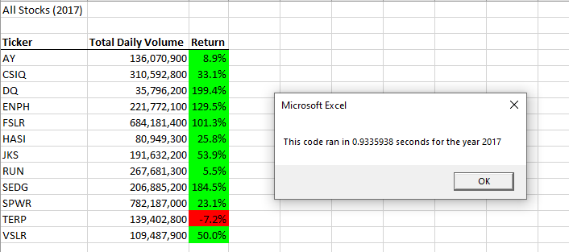
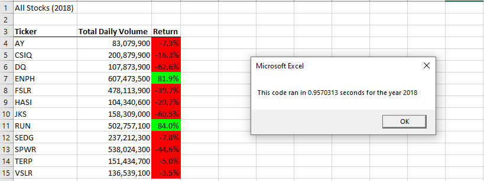

# A Stock Analysis

## Project Overview

The goal of this project is to analyze a series of stocks for performance over a couple years in anticipation of potential investment.

## Analysis

The analysis looked at several stocks over two years (2017 and 2018), focusing on their change in value from the beginning to the end of each year. The results of the analysis are as follows: 

.

.

As the data show, almost all stocks performed well in 2017 only to see a dramatic decrease in value in 2018. Two stocks showed positive gains in both years, however, ENPH (129.5% and 81.9%, respectively) and RUN (5.5% and 84.0%, respectively). It should be noted that one stock, VSLR, dropeed less than 5 percent in 2018 (-3.5%) after showing a positive gain in 2017 (50.0%). 

